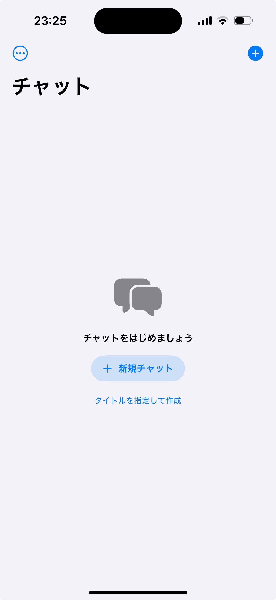
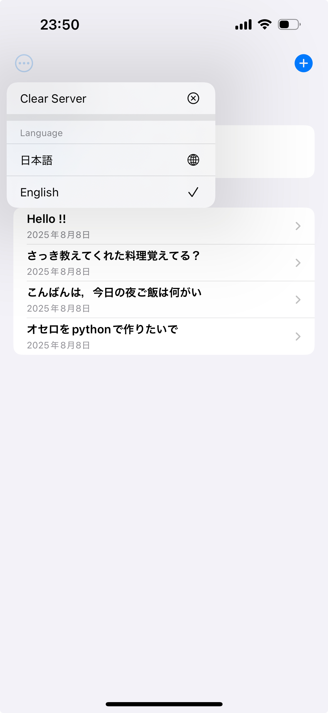
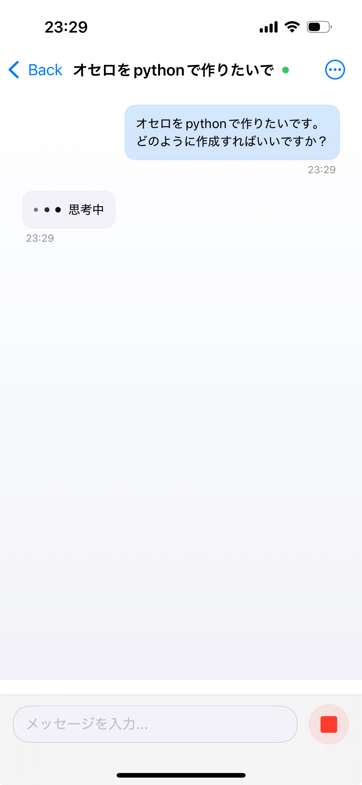
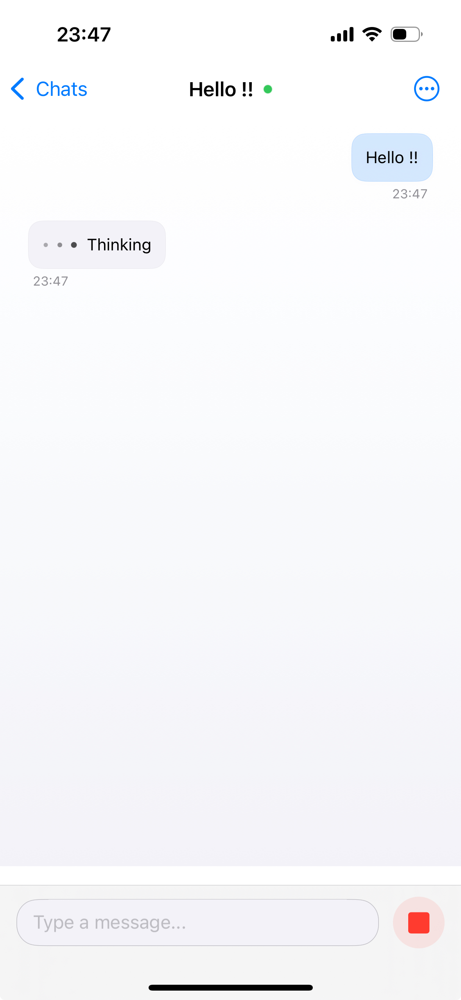
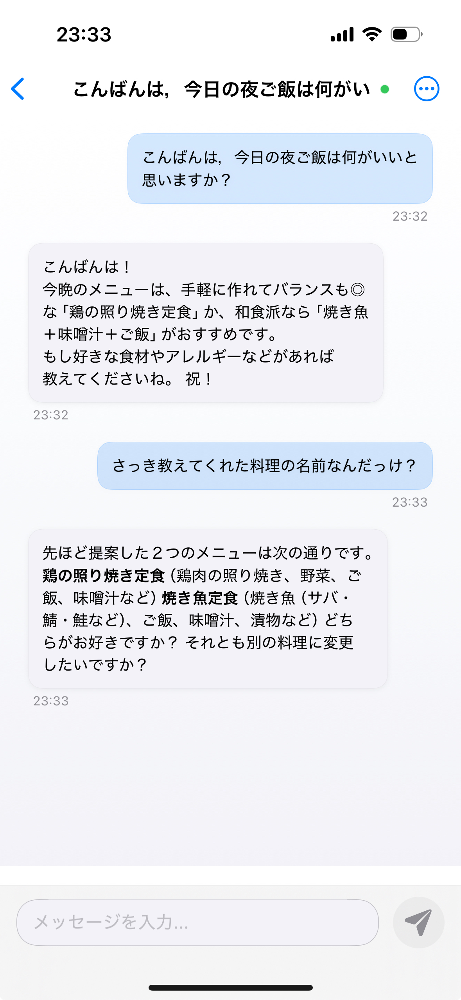
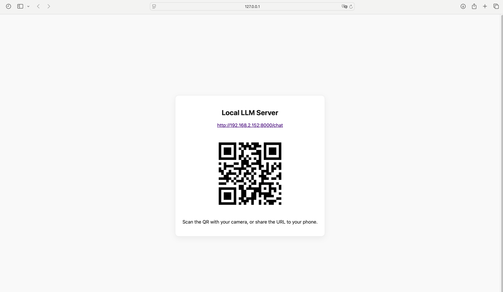

# Local LLM App (iOS + Local Server)

日本語の説明は下部に続きます / English follows.

---

## English

An iOS chat app built with SwiftUI that connects to your local LLM server. It supports streaming responses, Markdown rendering, multiple chat threads, QR-based server URL setup, and bilingual UI (English/Japanese).

**Main Feature:** By simply scanning the QR code, you can easily operate your local LLM from your iPhone. No complicated setup is needed—just scan and start chatting with your own model on your device.

- iOS client: `Local_LLM_App/` (SwiftUI + SwiftData)
- Local server: `server/` (Python)

### Features
- Streaming responses with typing indicator and stop button
- Clean, centered chat layout with Markdown support
- Multiple chat threads with auto-title from first user message
- Server URL setup via QR code scan or manual share
- Connection status indicator (green/gray/red)
- English and Japanese localization
- Backed by Ollama on the server; default model is the recently announced `gpt-oss:20b` (configurable)

### Screenshots

- Start screen
  
  

- Language selection (can switch to English)
  
  

- “Model is thinking” indicator (JA / EN)
  
  
  

- Streaming response with Markdown rendering
  
  
  
  _Note: This example shows the assistant remembering the thread context — previously suggested dishes like “chicken teriyaki set” and “grilled fish dish” are proposed again because they were discussed earlier._

- Local server shows a QR code for easy pairing
  
  
  


### Requirements
- Xcode 15+ (iOS 17+; uses SwiftData)
- Python 3.10+ for the server
- Ollama installed on the machine running the server
- Same network for iOS device/simulator and server host

### Quick Start

0) Prepare Ollama and the model (default: `gpt-oss:20b`)
```bash
# Install Ollama from https://ollama.com (follow official instructions)
# Then pull the default model
ollama pull gpt-oss:20b
```
- You can change the model via environment variable `OLLAMA_MODEL`.
- If Ollama runs on a different host/port, set `OLLAMA_BASE` (default: `http://localhost:11434`).

1) Start the server
```bash
cd server
python -m venv .venv
source .venv/bin/activate
pip install -r requirements.txt
python app.py
```
- The server proxies requests to Ollama using the model above.
- A browser tab opens with a QR page; scan it from the iOS app to configure the server URL.
- Note the server URL printed in the terminal (e.g. http://<host-ip>:<port>).
- If running on iOS Simulator, localhost works; on a physical device, use the host machine IP.

2) Run the iOS app
- Open `Local_LLM_App.xcodeproj` in Xcode and Run, or build via CLI:
```bash
xcodebuild -scheme Local_LLM_App -sdk iphonesimulator
```

3) Connect the app to the server
- In the top-right menu, choose “Scan Server QR” and scan the URL QR (or paste the URL via share).
- The dot next to the title shows connection status (green=connected, gray=not configured, red=error).

4) Chat
- Type your message and send. Responses stream in real time. Use the stop button to halt generation.

### Project Structure (high level)
- `Local_LLM_App/` iOS app (SwiftUI)
  - SwiftData models: `Item`, `ChatThread`
  - Networking: `ChatService`
  - UI: `ContentView`, `ThreadListView`, `MarkdownRenderer`, `QRScannerView`
  - Localization: `en.lproj/`, `ja.lproj/`
- `server/` Python app (`app.py`, `requirements.txt`)

### Ollama integration and models
- The server uses Ollama endpoints under `OLLAMA_BASE` (default `http://localhost:11434`).
- Default model is the recently announced `gpt-oss:20b` (override with `OLLAMA_MODEL`).
- Example environment variables:
```bash
export OLLAMA_BASE=http://localhost:11434
export OLLAMA_MODEL=gpt-oss:20b
```

### Troubleshooting
- Cannot connect: ensure both phone/simulator and server are on the same network.
- Simulator vs Device:
  - Simulator: you can use `http://localhost:<port>`
  - Device: use `http://<your-mac-ip>:<port>`
- Red status dot: check server is running and reachable; verify URL and port.
- Model not found: run `ollama pull gpt-oss:20b` on the server host.
- Using a remote Ollama: set `OLLAMA_BASE` to that host and ensure it’s reachable.

---

> **Note**
>
> This app is under active development. Specifications and design may change. If you find any issues or have requests, please feel free to contact the author.

---

## 日本語

SwiftUI で作られた iOS 向けローカル LLM チャットアプリです。ローカルサーバーと接続し、ストリーミング応答・Markdown 表示・複数スレッド・QR によるサーバー設定・日英ローカライズに対応しています。

**最大の特徴:** QRコードをiPhoneで読み込むだけで、ローカルLLMをスマートフォン上から簡単に操作できます。面倒な設定は不要、すぐに自分のモデルとチャットが始められます。

- iOS クライアント: `Local_LLM_App/`（SwiftUI + SwiftData）
- ローカルサーバー: `server/`（Python）

### 特長
- タイピング中インジケーターと停止ボタン付きのストリーミング応答
- 中央寄せの見やすいチャットレイアウト（Markdown 対応）
- 最初のユーザー入力から自動でスレッド名を生成
- QR コード読み取り／共有でサーバー URL を簡単設定
- タイトル横の接続状態ドット（緑/灰/赤）
- 英語・日本語ローカライズ
- サーバーは Ollama を利用。デフォルトのモデルは、発表されたばかりの `gpt-oss:20b`（変更可）

### スクリーンショット（説明つき）

- スタート画面
  
  

- 言語切替（英語に変更可能）
  
  

- s
  
  
  

- 応答表示（ストリーミング + Markdown）
  
  
  
  _補足: この例ではスレッド内の文脈を記憶しているため、先ほど提案された「鶏の照り焼き定食」や「焼き魚料理」が再度提案されています。_

- サーバー側に QR コードを表示（ペアリング用）
  
  
  


### 必要環境
- Xcode 15+（iOS 17+／SwiftData を使用）
- サーバー用 Python 3.10+
- サーバー側に Ollama をインストール
- 端末（またはシミュレータ）とサーバーが同一ネットワーク上

### はじめかた

0) Ollama とモデルの準備（デフォルト: `gpt-oss:20b`）
```bash
# 公式手順に従って Ollama をインストール
# 既定モデルを取得
ollama pull gpt-oss:20b
```
- モデルは環境変数 `OLLAMA_MODEL` で変更できます。
- Ollama のホスト/ポートが異なる場合は `OLLAMA_BASE` を設定します（既定: `http://localhost:11434`）。

1) サーバーを起動
```bash
cd server
python -m venv .venv
source .venv/bin/activate
pip install -r requirements.txt
python app.py
```
- サーバーは上記モデルを使って Ollama にプロキシします。
- 起動後、QR ページがブラウザで開きます。iOS アプリから読み取ってサーバー URL を設定できます。
- ターミナルに表示される URL（例: http://<ホストIP>:<ポート>）を確認してください。
- iOS シミュレータなら `localhost` が使えます。実機では Mac の IP アドレスを使ってください。

2) iOS アプリを実行
- `Local_LLM_App.xcodeproj` を Xcode で開いて実行、または CLI でビルド：
```bash
xcodebuild -scheme Local_LLM_App -sdk iphonesimulator
```

3) サーバー接続
- 右上メニューから「サーバー QR をスキャン」を選び、URL の QR を読み取る（または共有で URL を渡す）。
- タイトル横のドットで接続状態を確認（緑=接続、灰=未設定、赤=エラー）。

4) チャット
- メッセージを送信すると、応答がリアルタイムで流れます。停止ボタンで生成を中断できます。

### 構成（概要）
- `Local_LLM_App/` iOS アプリ（SwiftUI）
  - データ: `Item`, `ChatThread`（SwiftData）
  - 通信: `ChatService`
  - 画面: `ContentView`, `ThreadListView`, `MarkdownRenderer`, `QRScannerView`
  - ローカライズ: `en.lproj/`, `ja.lproj/`
- `server/` Python アプリ（`app.py`, `requirements.txt`）

### Ollama とモデル
- サーバーは `OLLAMA_BASE`（既定 `http://localhost:11434`）配下の Ollama API を利用します。
- 既定モデルは、発表されたばかりの `gpt-oss:20b`（`OLLAMA_MODEL` で上書き可能）。
- 例（環境変数）:
```bash
export OLLAMA_BASE=http://localhost:11434
export OLLAMA_MODEL=gpt-oss:20b
```

### トラブルシューティング
- 接続できない: 端末/シミュレータとサーバーが同一ネットワークか確認。
- シミュレータと実機の違い:
  - シミュレータ: `http://localhost:<port>` が利用可能
  - 実機: `http://<MacのIP>:<port>` を使用
- 赤いドット: サーバーが起動しているか、URL/ポートが正しいか確認。
- モデルが見つからない: サーバー側で `ollama pull gpt-oss:20b` を実行。
- リモートの Ollama を使う: `OLLAMA_BASE` をそのホストに設定し、到達できることを確認。

---

> **ご注意**
>
> このアプリは現在開発中です。仕様やデザインは今後変更される場合があります。不具合やご要望があればお気軽にお問い合わせください。

---


